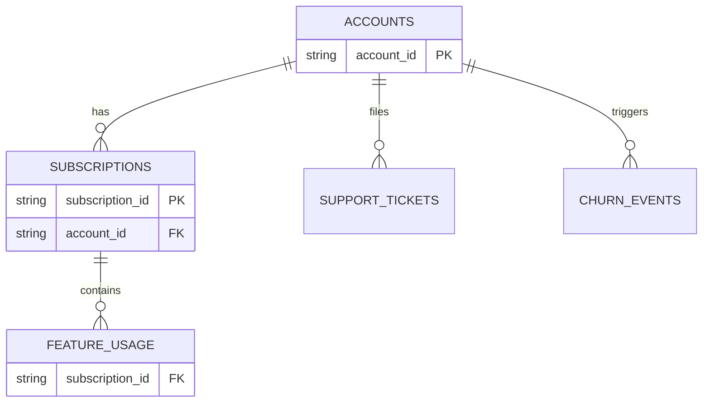
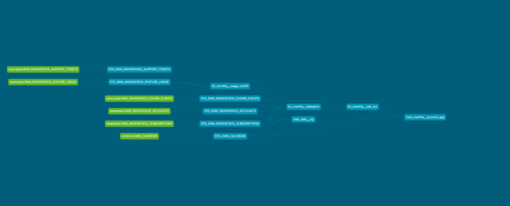
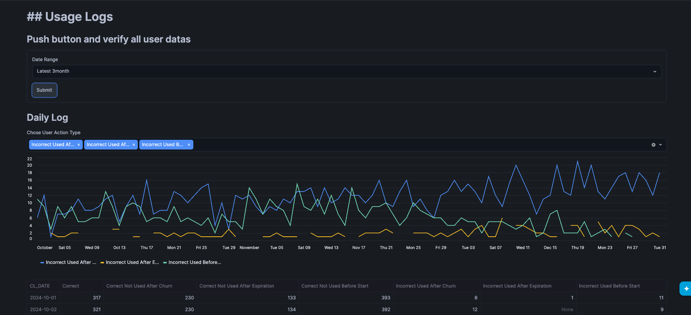
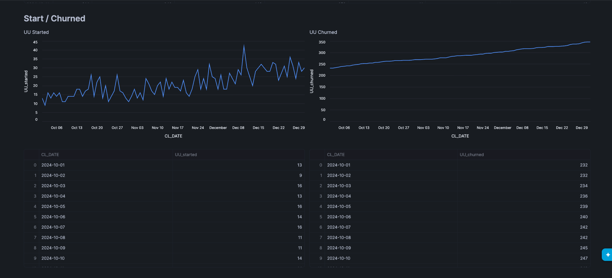
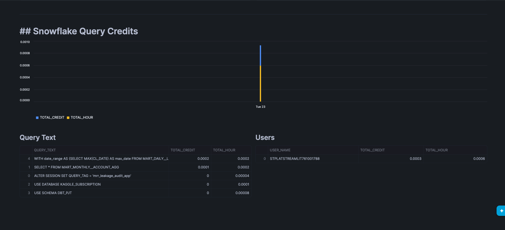

# Enterprise SaaS Revenue Leakage Audit & Financial Analytics Platform

---

## 📈 Business Case & Analytical Problem Statement
SaaS company generally has 2 problems in data usage.

1. Dealing with mismatched data between data from system and data from actual usage.  
    example. 
    * Services continue to be used after contract has expired  
    * Users continue to use the premium features after downgrading their plans
2. Monitoring the credit costs in Snowflake

In this project, I implemented 2 mart tables to analyze the Monthly Recurring Revenue(MRR) and to monitor User's incorrecct usage with dbt and Snowflake. 

Additionaly, Streamlit dashboard is implemented to analyze the data made here and it can monitor how much credit is used cost from the dashboard.

Environment : 
* Python : 3.12.0
* dbt : 1.11.11
* Snowflake 
* Streamlit
* Github Actions

---

## 🛠️ Data Infrastructure & Tech Stack

```mermaid
graph TD
    A[Kaggle / Olist Compressed Zip] -->|Manual Stage Allocation| B(Snowflake Internal Stage)
    B -->|Encrypted File Stream Access| C[Snowpark Python Engine]
    C -->|In-Memory Chunked Streaming| D[Snowflake Compute Pushdown]
    D -->|High-Throughput Bulk Insertion| E[(Snowflake Database: RAW Layer)]

    subgraph GitHub Actions Pipeline
        F[GitHub CI Runner] -->|Asymmetric RSA-2048 Key-Pair Handshake| D
        F -->|dbt test & run| G[GitHub Actions Slim CI]
    end

    E -.->|dbt Models| H[dbt Core Models]
    H --> I[Streamlit in Snowflake]

    style B fill:#333,stroke:#29B6F6,stroke-width:2px;
    style D fill:#1A237E,stroke:#29B6F6,stroke-width:2px;
    style E fill:#0D47A1,stroke:#FFF,stroke-width:2px;
    style F fill:#4CAF50,stroke:#FFF
```

### dbt lineage
This project is for self-skilling so that Source table is from Kaggle,   
This is the architecture of tables in this project. details are [here](https://www.kaggle.com/datasets/rivalytics/saas-subscription-and-churn-analytics-dataset).

### Data leanage of this project:  

Tha main tables in this project are `mart_daily_log` and  `mart_monthly__account_agg`. 

#### `mart_daily_log` 
The grain level in this table is `subscription x account_id x cl_date`,   
usage_status is the main purpose of this table, other columns are used for additional information.This table is used in usage logs in streamlit.

Schema : 
* subscription_id
* account_id
* cl_date 
* subscription_tier
* start_date
* end_date
* is_used
* is_churned
* is_started
* usage_status

#### `mart_monthly__acount_agg`
The grain level in this table is `account_id x cal_month`,  
this table aggregate the monthly revenue and supports comparing the expected revenue and actual revenue from users. and it also tracks the user's monthly payment action type with `payment_status`.

Schema : 
* account_id
* cal_month
* mrr_amount
* act_month_usd
* usage_count
* is_started
* is_churned
* payment_status

## 💡 Advanced Technical Highlights & Core Optimizations

### 1. Conditional Window Aggregations (Single-Pass Modeling)
In mart tables, I used single-pass window aggregation to calculate status columns. It will take less computing and beneficial on finance.

### 2. Real-Time FinOps Self-Auditing Query Pipeline  

In standard feature of snowflake, it's impossible to get the credit   consumed in Streamlit dashboard in real-time because the credit data is only in account usage views. (Account-usage views will be updated 45mins ~ 1 day after executing queries.).However, I implemented the Credit Cost View at last section in dashboard.  

I calculated the cost timeline based on the query_history view `in information_schema` which has real-time updating. It will calculate the total credit in a day and you can analyze what kind of queries or whose queries took credit most.

---

## 🧪 Data Quality Assurance & Governance (`test.yml`)
In dbt project, the data_tests are implemented to make workflow success expectedly. 

* `Relationship test` : Verifying the FK in child table is included in parent table.  

* `Unique/Not Unique test` : Verifying the UK is unique or not. Mart table has unique_combination_columns_test to check the data's grain is same as expected.

---

## ⚠️ Architectual Note on datasource Limitations
Due to the absence of the explicit payment gateway webhooks (example,   Stripe) and feature-tier metadata in the underlying kaggle dataset,   
The MRR movements and payment satus are programmatically imputed using single-pass window aggregations over subscription. While highly effective for this analytical scope, an enterprise-grade refactoring would replace these assumptions with direct snowpipe CDC ingestion from backend.  

---

## 📊 Dashboard Sneak Peek (UI/UX Breakdown)
Streamlit project repository is [here](https://github.com/lovehakumai/monitor_revenue_leakage_snowflake)

